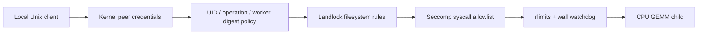

# Linux Service Isolation Lab

[](https://github.com/JDinSeattle/linux-service-isolation-lab/actions/workflows/ci.yml)

A local Linux worker broker that authenticates clients through Unix `SO_PEERCRED`, authorizes exact operations by UID, pins the GEMM executable digest, and launches each job under real Landlock and seccomp restrictions plus rlimits and a wall deadline.

The 17-case integration matrix executes allowed work and attempts out-of-scope reads/writes, a symlink escape, network socket creation, process creation, ptrace, excess memory, excess descriptors, file capacity, CPU exhaustion, a wall timeout, unauthorized operation and UID spoofing. Positive unconfined controls prove the host can perform representative operations before confinement denies them. The recorded host reports Landlock ABI 8; the policy uses rights through ABI 3.

This is an explicitly added project E: the source career brief only defined A–D. It complements artifact trust with OS enforcement. It is **not** a container escape audit, multi-tenant production boundary, cgroup controller, PID/network namespace implementation or root-adversary defense.

## September 2026 maintenance

Each Unix request now has one monotonic deadline across all recv calls, so a slow peer cannot renew the budget by sending individual bytes. Malformed/truncated/oversized messages reject cleanly; best-effort bounded response writes tolerate a disconnected peer and allow the next policy-checked request. Socket cleanup checks the original inode and socket type before unlinking, preserving a replacement path. The existing actual SO_PEERCRED and kernel confinement campaign remains in place.

[Design, acceptance tests and limits](docs/refresh-20260907.md) · [Current measured results](docs/refresh-results-20260907.md). CI repeats validation on Python 3.12 and 3.14.7.

## Reproduce

```bash
git clone https://github.com/JDinSeattle/linux-service-isolation-lab.git
cd linux-service-isolation-lab
make verify
python3 evidence.py .runs/latest
```

`make test` runs focused contract regressions. `make verify` also builds and executes real integration/fault experiments. A prior `.runs/latest` is moved to a timestamped archive before a fresh run; nonempty output directories outside `.runs` are never overwritten. GitHub Actions executes the same entry point and uploads evidence even on failure.

The checked-in [local evidence](evidence/local/) has raw records, a source/environment manifest and SHA-256 artifact hashes. Verify it with `make evidence-check`. [Measured results](docs/results.md), [engineering notes](docs/engineering.md), and [interview guide](docs/interview.md) explain what can be claimed.

## System



The launcher sets no_new_privs, requires Landlock ABI ≥3, grants read/execute to the worker and runtime libraries, grants bounded scratch-file access, closes inherited descriptors ≥3, installs a native x86_64 syscall allowlist, and execs with a fixed locale-only environment. Unknown syscalls return EPERM and a foreign syscall architecture kills the process. Worker creation is denied after exec. Runtime library paths are trusted host dependencies.

## Support and evidence limits

Linux x86_64 with Landlock ABI ≥3 and seccomp filter support, Python ≥3.10, gcc/g++. Unsupported kernel capabilities fail the integration test; they are not silently counted as passes. The tested budget is 64 MiB address space, 32 open descriptors, 32 KiB per file, 1 s CPU soft limit (2 s hard), plus parent-enforced wall deadline. RLIMIT_FSIZE is per file, not total disk quota, and RLIMIT_AS is virtual address space, not RSS. File descriptors are closed before exec; openat is further constrained by Landlock. Local socket mode is 0600. The same UID identifies one local trust principal, not individual users sharing that account; root/host administrators, mutable trusted binaries, resource pressure outside the worker and cgroup quotas are outside scope. No independent penetration test was performed.


**Role evidence:** Linux security · platform engineering. This is an author-operated engineering lab. AI-assisted implementation is disclosed; ownership means understanding, reproducing and explaining the code and measurements. No external customer, production operation, upstream contribution or independent reviewer is implied.

MIT licensed. Operator source vendoring, where present, is recorded in `vendor/lock.json`; upstream workload attribution, where present, is in `upstream/`.
