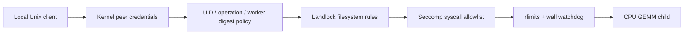

# Engineering contract

The launcher sets no_new_privs, requires Landlock ABI ≥3, grants read/execute to the worker and runtime libraries, grants bounded scratch-file access, closes inherited descriptors ≥3, installs a native x86_64 syscall allowlist, and execs with a fixed locale-only environment. Unknown syscalls return EPERM and a foreign syscall architecture kills the process. Worker creation is denied after exec. Runtime library paths are trusted host dependencies.

## Compatibility and limits

Linux x86_64 with Landlock ABI ≥3 and seccomp filter support, Python ≥3.10, gcc/g++. Unsupported kernel capabilities fail the integration test; they are not silently counted as passes. The tested budget is 64 MiB address space, 32 open descriptors, 32 KiB per file, 1 s CPU soft limit (2 s hard), plus parent-enforced wall deadline. RLIMIT_FSIZE is per file, not total disk quota, and RLIMIT_AS is virtual address space, not RSS. File descriptors are closed before exec; openat is further constrained by Landlock. Local socket mode is 0600. The same UID identifies one local trust principal, not individual users sharing that account; root/host administrators, mutable trusted binaries, resource pressure outside the worker and cgroup quotas are outside scope. No independent penetration test was performed.

## Real probe failure and repair

The first optimized memory test used `malloc(128 MiB); inspect pointer; free(pointer)` without any observable allocated-memory use. GCC 15.2 removed the allocation, so the probe returned success even under a 64 MiB address-space limit. `docs/failures/allocation-elided.txt` and the before disassembly preserve that failure. The repaired probe uses a runtime size, a compiler barrier exposing the pointer, and a volatile store on success. The final unconfined control allocates successfully, while the confined test returns ENOMEM; final assembly is archived. This is a test-oracle reliability fix, not a newly discovered Linux isolation vulnerability.

## Identity and deployment

`SO_PEERCRED` reads UID/GID/PID from the kernel socket peer. A JSON `uid` field is rejected as an extra field; it cannot override the authenticated identity. UID policy grants only `gemm`, never arbitrary commands or executable paths. The worker source is checksum-pinned and the compiled worker digest is checked before each launch. The broker runs in a trusted directory; it never unlinks an existing socket at startup.

After `make verify`, use `evidence/local/policy-example.json` as a shape reference, then generate a local policy with your UID and the SHA-256 of your rebuilt worker (do not blindly reuse the author's binary digest). Start `python3 broker.py --socket .runs/worker.sock --policy YOUR_POLICY --scratch-root .runs/jobs`. Socket mode 0600 plus kernel credentials intentionally restrict this demo to the owner. Cross-UID principal tests are unit-level policy tests; no root/setuid setup is implied.

Reference: [kernel Landlock userspace API](https://docs.kernel.org/userspace-api/landlock.html). The kernel may expose a newer ABI; this launcher handles filesystem rights through ABI 3 and denies unlisted syscalls through seccomp. It does not dynamically claim support for newly added ABI rights.
